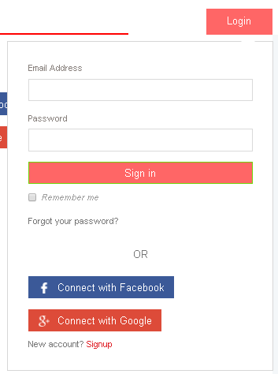

# Documento de Visão do Projeto "Travel Mack"

Este documento apresenta uma solução de software para pessoas que procuram passagens aéreas com os preços mais baratos do mercado.

## Objetivo

* Oferecer uma plataforma de fácil acesso para procurar e comparar passagens aéreas com os preços mais baratos dentre as diversas empresas aéreas.

## Problema

* Descrição do problema: Dificuldade em reunir informações sobre os preços de passagens aéreas disponibilizados pelas empresas do segmento.
* Quem é afetado pelo problema: Pessoas que estão à procura de um serviço que otimize o tempo e a burocracia na compra de passagens aéreas.
* Impacto no negócio: Melhora de serviços por parte das empresas aéreas devido a facilidade do usuário em comparar preços e o tipo de serviço que estas fornecem. Possibilitando, assim, que cada pessoa escolha sua passagem de acordo com sua necessidade.
* Benefícios de uma boa solução: Uma melhor e mais eficiente experiência pelos usuários em compra de passagens aéreas.

## Integração com outros sistemas

* Amadeus Travel Innovation Sandbox.
* CloudantNoSQL
* IBM Cloud

> **Comentário do professor:** CloudantNoSQL e IBM Cloud não seriam as plataformas de hospedagem da aplicação?

## Usuários

* Cliente interessado em comprar um passagem aérea.

## Funcionalidade do produto

* Mostrar passagens com o preço mais baixo do mercado.

> **Comentário:** O texto da seção Problema dá a entender que é difícil reunir informações de diversas empresas, mas parece que este problema já está resolvido pela Amadeus Travel. Seria interessante adicionar outras funcionalidades, pois a aplicação parece que se resume a um front-end que acessa um serviço já pronto. Exemplo: Talvez a aplicação possa guardar as últimas pesquisas e as vendas feitas pela aplicação.

> **Comentário:** Não haveria também a funcionalidade de notificações caso algum vôo de interesse esteja disponível?

## Restrições do projeto

* Aplicação mobile apenas para iOS.
* Página web será adaptado para todos os navegadores.

## Protótipos de tela

### Protótipos para funcionalidade 1

Fonte: Página web Travel Mack.

### Protótipos para funcionalidade 2

Fonte: Página web Travel Mack.

### Protótipos para funcionalidade 3

