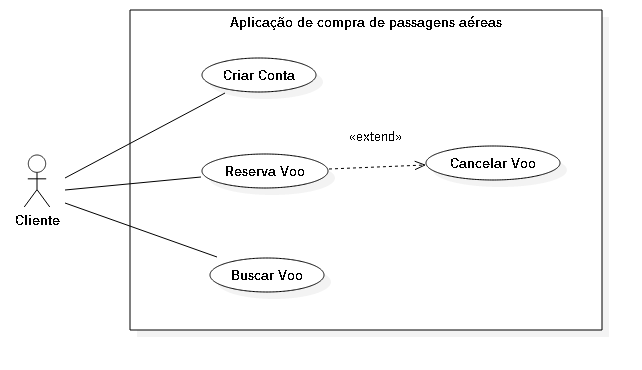

# Casos de uso

## 1. Diagrama de casos de uso

**Instruções do professor**: Insira abaixo o diagrama com os casos de uso do seu sistema. A imagem abaixo é somente um exemplo.

## 2. Especificação dos casos de uso

**Instruções do professor**: Para cada caso de uso, criar as tabelas com a especificação do caso de uso. Siga o exemplo dado abaixo:

### 2.1. Caso de uso **CRIAR CONTA**

| Campo          | Informação        |
|---|---|
| Identificador: | UC01              |
| Nome:          | Criar conta |
| Atores:        | Cliente |
| Sumário:       | Registra uma nova conta no sistema |

| Fluxo Principal |
|---|
| 1) O cliente seleciona a opção **Criar nova conta**. |
| 2) O sistema mostra o formulário para criar uma nova conta. |
| 3) O cliente preenche o formulário com os dados necessários. |
| 4) O sistema recebe e checa se os dados são válidos. |
| 5) O sistema registra o cliente e informa que a operação foi bem-sucedida. |

| Fluxo Alternativo (2a): Os dados inseridos pelo cliente são inválidos. |
|---|
| 1) O sistema informa que um ou mais dados do formulário preenchido estão inválidos. |
| 2) O sistema não registra os dados do cliente. |
| 3) O sistema retorna ao passo (2) do fluxo principal. |

**Instruções do professor**: As tabelas acima mostram um exemplo de especificação de **um único caso de uso**. Lembre-se de especificar cada um dos casos de uso.

### 2.2. Caso de uso **BUSCAR VOO**

| Campo          | Informação        |
|---|---|
| Identificador: | UC02              |
| Nome:          | Buscar voo |
| Atores:        | Cliente |
| Sumário:       | Busca informações de um voo no sistema |

| Fluxo Principal |
|---|
| 1) O cliente informa os dados do voo e seleciona a opção **Buscar voo**. |
| 2) O sistema recebe os dados e busca voos de acordo com os dados informados. |
| 3) O sistema mostra todos os voos de acordo com a pesquisa do cliente. |

| Fluxo Alternativo (2a): Não há voos de acordo com os dados informados. |
|---|
| 1) O sistema informa que não há voos de acordo com os dados. |
| 2) O sistema retorna ao passo (1) do fluxo principal. |

### 2.3. Caso de uso **RESERVAR VOO**

| Campo          | Informação        |
|---|---|
| Identificador: | UC03              |
| Nome:          | Reservar voo |
| Atores:        | Cliente |
| Sumário:       | Reserva um voo para um cliente |

| Fluxo Principal |
|---|
| 1) O cliente seleciona a opção **Reservar voo**. |
| 2) O sistema mostra as formas de pagamento disponíveis. |
| 3) O cliente seleciona a forma de pagamento selecionada. |
| 4) O sistema recebe a forma de pagamento e realiza o processo. |
| 5) O sistema registra o voo para o cliente e informa que a operação foi bem sucedida. |

| Fluxo Alternativo (2a): Forma de pagamento não aceita. |
|---|
| 1) O sistema informa que a forma de pagamento foi recusada. |
| 2) O sistema retorna ao passo (3) do fluxo principal. |

### 2.4. Caso de uso **CANCELAR VOO**

| Campo          | Informação        |
|---|---|
| Identificador: | UC04              |
| Nome:          | Cancelar voo |
| Atores:        | Cliente |
| Sumário:       | Cancela o voo de um cliente |

| Fluxo Principal |
|---|
| 1) O cliente seleciona um voo reservado. |
| 2) O cliente seleciona a opção **Cancelar voo**. |
| 3) O sistema pede a confirmação do cancelamento. |
| 3) O cliente confirma o cancelamento. |
| 4) O sistema cancela a reserva de voo do cliente. |

| Fluxo Alternativo (2a): Cliente não confirma o cancelamento. |
|---|
| 1) O sistema informa que a reserva de voo não foi cancelada. |

